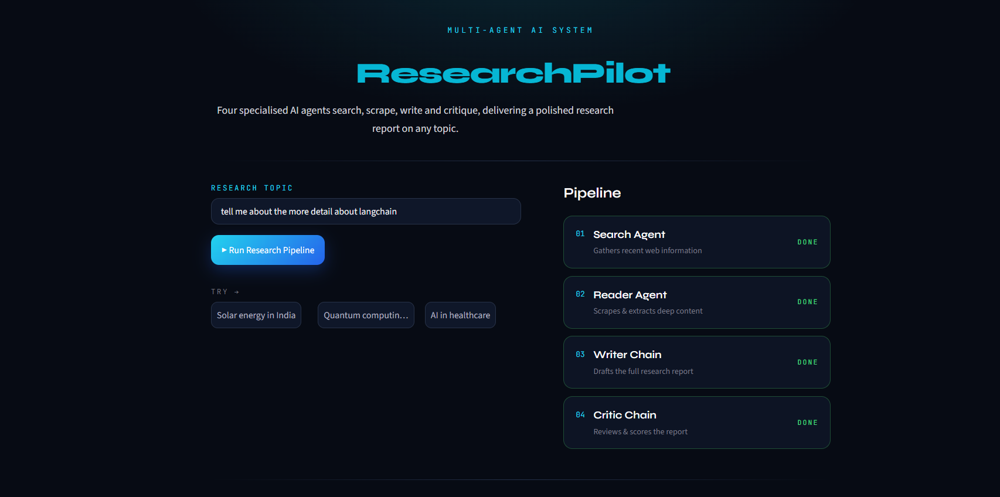
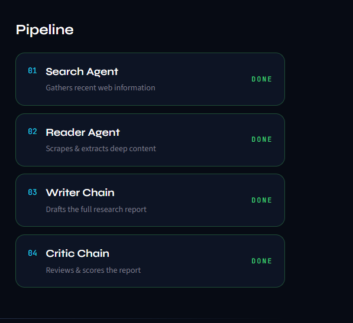
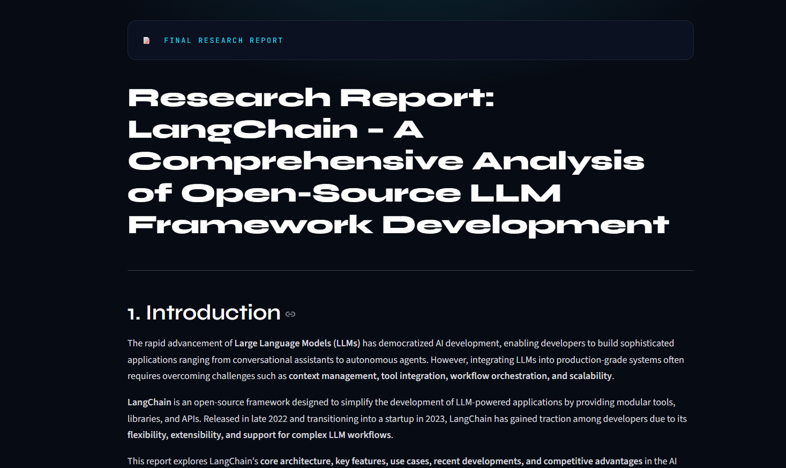
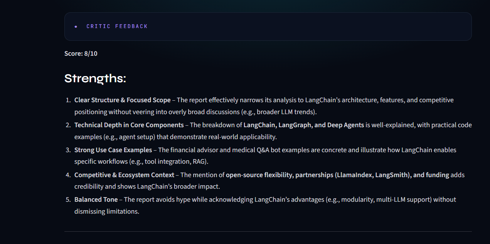

# 🧭 ResearchPilot

**Four specialised AI agents search, scrape, write and critique, delivering a polished research report on any topic.**


## 🚀 Live Demo

**👉 [Open ResearchPilot](https://research-pilot-khushi-singhh.streamlit.app/)**

## 🖼️ Application preview

| Home | Pipeline running |
|------|------------------|
|  |  |

| Final report | Critic feedback |
|--------------|-----------------|
|  |  |

## ✨ Overview

ResearchPilot is a multi-agent research system. You enter a topic, and a team of AI agents works through it step by step:

| Step | Component | What it does |
|------|-----------|--------------|
| 01 | **Search Agent** | Searches the web with Tavily and gathers recent sources |
| 02 | **Reader Agent** | Picks the most relevant URL and scrapes it with BeautifulSoup for deeper content |
| 03 | **Writer Chain** | Drafts a structured report (Introduction, Key Findings, Conclusion, Sources) |
| 04 | **Critic Chain** | Reviews the report and returns a score, strengths and areas to improve |

The Streamlit interface shows the status of each step live, and lets you read the raw search results, the scraped content, the final report and the critic feedback. The report can be downloaded as a Markdown file.

## 🏗️ Architecture

```
Topic ──► Search Agent ──► Reader Agent ──► Writer Chain ──► Critic Chain
          (Tavily tool)    (BeautifulSoup   (LCEL pipeline)  (LCEL pipeline)
                            tool)
                                                  │                │
                                                  ▼                ▼
                                            Research report   Score + feedback
```

- **Agents** are built with LangChain's `create_agent` (ReAct-style tool calling on LangGraph) and each is connected to its own tool.
- **Writer and critic** are LCEL pipelines: `prompt | llm | StrOutputParser()`.
- **LLM:** Mistral AI (`ministral-3b-latest`) through `langchain-mistralai`.

## 🛠️ Tech Stack

- **Language:** Python 3.12
- **Orchestration:** LangChain 1.x, LangGraph, LCEL (Runnables)
- **LLM:** Mistral AI
- **Tools:** Tavily Search API, BeautifulSoup4 + Requests
- **UI:** Streamlit
- **Config:** python-dotenv

## 📁 Project Structure

```
researchpilot/
├── app.py              # Streamlit UI (entry point)
├── agents.py           # Agents, prompts, writer and critic chains
├── tool.py             # web_search (Tavily) and scrape_url (BeautifulSoup) tools
├── pipeline.py         # Terminal version of the pipeline
├── requirements.txt    # Dependencies
├── assets/             # Screenshots used in this README
├── .gitignore
└── README.md
```

## ⚙️ Run Locally

### 1. Clone the repository

```bash
git clone https://github.com/Khushi18Singh/researchpilot.git
cd researchpilot
```

### 2. Create a virtual environment and install dependencies

Using **uv**:

```bash
uv venv
.venv\Scripts\activate        # Windows
# source .venv/bin/activate   # macOS / Linux
uv pip install -r requirements.txt
```

Or using **pip**:

```bash
python -m venv .venv
.venv\Scripts\activate        # Windows
# source .venv/bin/activate   # macOS / Linux
python -m pip install -r requirements.txt
```

### 3. Add your API keys

Create a `.env` file in the project root:

```env
MISTRAL_API_KEY=your_mistral_api_key
TAVILY_API_KEY=your_tavily_api_key
```

- Mistral API key: [console.mistral.ai](https://console.mistral.ai)
- Tavily API key: [tavily.com](https://tavily.com)

### 4. Start the app

```bash
streamlit run app.py
```

To run the terminal version instead:

```bash
python pipeline.py
```

## ⚠️ Known Limitations

- The free Mistral and Tavily tiers have rate limits, so you may occasionally see `429` or connection errors. Waiting a minute and retrying usually fixes it.
- Some websites block scrapers or load content with JavaScript, so the reader agent may return little or no text for them.
- Report quality depends on the sources found and on the small free-tier model.

## 🔮 Future Improvements

- Scrape multiple URLs instead of one
- Let the writer revise the report using the critic's feedback
- Export the report as PDF
- Add support for other LLM providers

## 👤 Author

**Khushi Singh**


Hi, I'm KHUSHI SINGH, with an interest in AI agents, LLM applications and data. I built ResearchPilot to learn how multiple agents and tools can work together in one pipeline, from tool calling with Tavily and BeautifulSoup to LCEL chains and a Streamlit interface.
I enjoy turning ideas into working projects and I'm currently looking to grow in the field of AI and data.


---

If you found this project useful, consider giving it a ⭐
